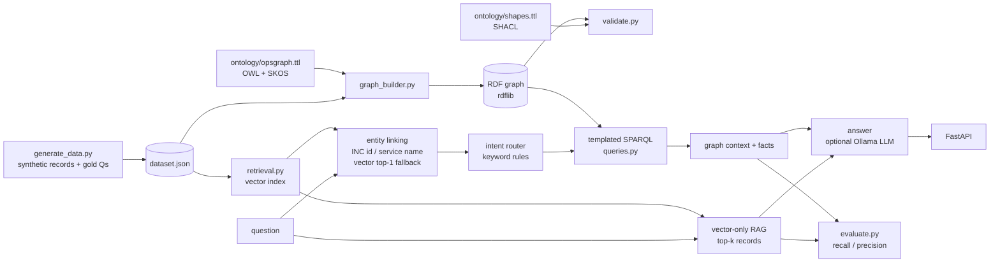

# Architecture

## Two retrieval paths over the same records

| | Vector-only RAG | GraphRAG |
|---|---|---|
| Unit retrieved | Whole incident record as text | Entities and relations via SPARQL |
| Finds | Records textually similar to the question | Records connected by explicit edges |
| Fails on | "Which incidents share this root cause?" (the other incidents do not mention the question's text) | Questions the intent router does not recognise |

## Design decisions

- **Gold answers are computed from raw records in plain Python**, not from the graph. A correct SPARQL query has to reproduce them independently. `tests/test_queries.py` asserts this.
- **Entity ids are validated before substitution into SPARQL** (`queries._iri`), so question text cannot inject query syntax.
- **SHACL is a gate**: CI fails if the generated graph stops conforming (`opsgraph.cli all --check`).
- **Backend fallback**: sentence-transformers if installed, otherwise TF-IDF. The backend used is written to `reports/results.json`.

## Known limitations

1. Intent routing is keyword rules. Paraphrased questions can be misrouted.
2. SPARQL is templated. LLM text-to-SPARQL is not implemented.
3. The graph path gets exact-id entity linking that the vector baseline does not.
4. Data is synthetic, so the comparison is controlled, not a production result.
5. Gold questions are template-generated. Add hand-written ones in `data/gold_manual.json`.
